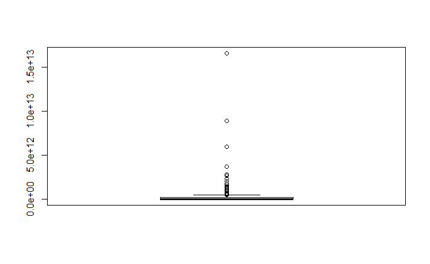
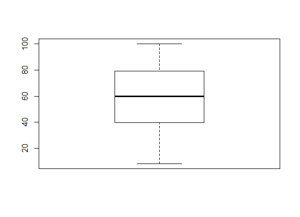
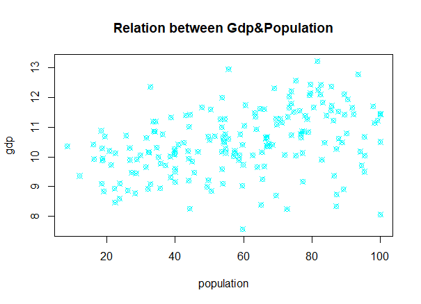
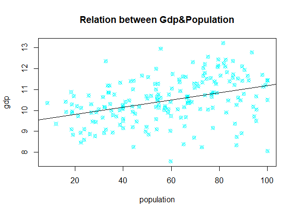
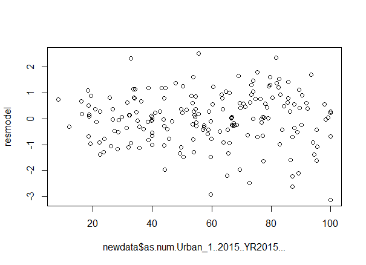

# Population_GDP

To examine a statistical objects which are urban population and GDP.

## Images

We produce boxplot for checking variables’ normality. Firstly we are checking “Gdp”.

As seen that it is very skewed. GDP of 2015 variable is not normal distrbution. Now we check urban population of 2015 variable.

This variable is almost normal distribution.
We produce scatter plot for seeing relation between variables. Firtsly we produce new data frame. Then we produce scatter plot. While we are producing scatter plot, we use log10 function with gdp of 2015 variable to get better results.

Then we fit a least-squares regression line and run a residual model diagnostic.

We plot residuals for interpretation of prediction.

